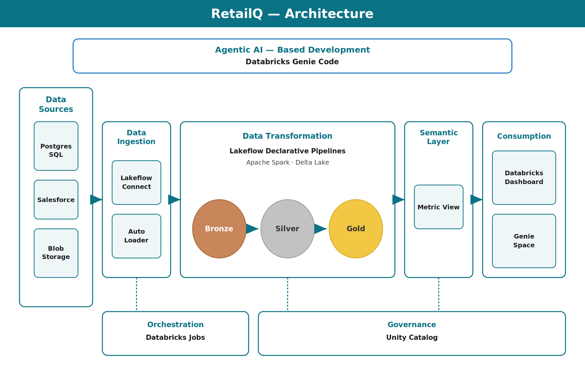

# RetailQ — Multi-Source Retail Analytics Platform on Databricks

An end-to-end lakehouse platform that ingests data from three sources into a governed medallion architecture and surfaces retail KPIs through a Databricks dashboard.

## Overview

RetailQ pulls retail data from Postgres, Salesforce, and blob storage, processes it through Bronze → Silver → Gold layers using Lakeflow Declarative Pipelines, models it in a semantic layer, and serves analytics via a Databricks dashboard and Genie Space.

## Architecture



**Flow:** Data Sources → Ingestion → Transformation (Medallion) → Semantic Layer → Consumption

| Layer | Tools |
|-------|-------|
| Data Sources | Postgres SQL, Salesforce, Blob Storage |
| Ingestion | Lakeflow Connect, Auto Loader |
| Transformation | Lakeflow Declarative Pipelines, Apache Spark, Delta Lake |
| Semantic Layer | Metric View |
| Consumption | Databricks Dashboard, Genie Space |
| Orchestration | Databricks Jobs |
| Governance | Unity Catalog |

## Medallion Layers

- **Bronze** — Raw ingested data, one schema per source (`postgres_bronze`, `salesforce_bronze`, `blob_bronze`)
- **Silver** — Cleaned, deduplicated, conformed tables (`retail_silver`)
- **Gold** — Business-level aggregates and star schema (`retail_gold`)
- **Semantic** — Reusable KPI definitions via Metric View (`retail_semantic`)

## Tech Stack

- Databricks (Free Edition)
- Lakeflow Declarative Pipelines (DLT)
- Delta Lake
- Unity Catalog
- Auto Loader
- Databricks Jobs
- Databricks Dashboards & Genie

## Dashboard

The dashboard reports core retail metrics: total revenue, transaction count, unique customers, average transaction value, revenue trends by date and quarter, and revenue by product category and sales channel.

## Data Quality

Validation in the Gold layer checks for referential integrity between fact and dimension tables (customer keys, product category joins) to catch orphaned or unmatched records before they reach reporting.

## Repo Structure

```
├── notebooks/          # Pipeline and transformation code
├── pipelines/          # Lakeflow pipeline definitions
├── dashboards/         # Dashboard export
├── docs/               # Architecture diagram, screenshots
└── README.md
```

## Author

**Bhavith** — Power BI / Analytics Developer & Microsoft Fabric Data Engineer
[Portfolio](https://bhavith-portfolio.vercel.app) · [GitHub](https://github.com/bhavith1993)
